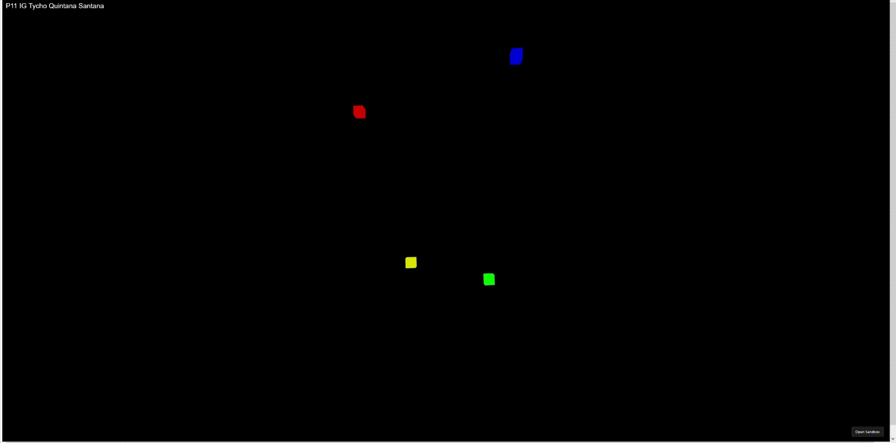

# Animación con Tween.js

## Link al proyecto

[Enlace al proyecto en CodeSandbox](https://codesandbox.io/p/sandbox/entrega-p11-ig-tycho-quintana-santana-22zwmg)

El código fuente se encuentra en este repositorio también, pero se recomienda más revisarlo en CodeSandbox que tiene previsualización y además el entorno ya está preparado
para funcionar con el código.

## Descripción de entrega

El trabajo consiste en la implementación de un prototipo 3D de temática libre, haciendo uso de la biblioteca _Tween.js_ para mediante el uso de fotogramas claves realizar una animación.

El entregable que se presenta simula la [emblemática secuencia de inicio de Windows 7](https://www.youtube.com/watch?v=rDwhgOK5YUA). En la animación cuatro cubos de colores (rojo, verde, azul y amarillo), convergen desde posiciones muy dispersas hacia un punto central de la escena. Este movimiento es curvo, fluido y tridimensional, finalizando con un efecto de iluminación coordinado que marca la finalización de la secuencia.

Al mismo tiempo aparecen los mismos créditos que en el vídeo en el que hacemos referencia. Simulando la pantalla de carga mediante una animación 3D.

La animación está implementada usando _Three.js_ y _Tween.js_.

## Trabajo realizado

### Descripción del trabajo realizado

Se ha diseñado una escena inmersiva y oscura para que el foco de atención recaiga totalmente sobre los cubos y su movimiento animados, tal y como sucede en la pantalla de carga de Windows 7. La coreografía de la animación es el elemento principal: los cuatro cubos ejecutan trayectorias curvas individuales predefinidas y sincronizadas, intentando replicar las que se dan en la animación de referencia.

### Desarrollo principal

El código se estructura principalmente en dos partes que se ejecutan secuencialmente:
- La inicialización de la escena y sus elementos (los cubos)
- La animación de la misma.

La parte de inicialización comienza con la llamada al método `init()`, que se encarga de inicializar la escena en _Three.js_ creando la cámara y colocándola en la escena, preparando el color del fondo para que sea completamente negro, creando el _renderer_, preparando la iluminación mediante
la llamada a la función `setIlumination()` y generando el texto que se ve arriba a la izquierda que indica la autoría mediante la invocación de la función `createAuditOverlay()`.

```javascript
function init() {
    scene = new THREE.Scene();
    scene.background = new THREE.Color(0x000000);

    camera = new THREE.PerspectiveCamera(
        75,
        window.innerWidth / window.innerHeight,
        0.1,
        1000
    );
    camera.position.set(0, 1, 5);

    renderer = new THREE.WebGLRenderer({ antialias: true });
    renderer.setSize(window.innerWidth, window.innerHeight);
    document.body.appendChild(renderer.domElement);
    setIlumination();
    createTextOverlay();
}
```

La función `createAuditOverlay()` añade un elemento a la página con el nombre escrito que se situará por arriba a la izquierda.

```javascript
function createAuditOverlay() {
    const textDiv = document.createElement("div");
    textDiv.style.position = "absolute";
    textDiv.style.top = "20px";
    textDiv.style.left = "20px";
    textDiv.style.color = "white";
    textDiv.style.fontSize = "24px";
    textDiv.style.fontFamily = "Arial, sans-serif";
    textDiv.style.pointerEvents = "none";
    textDiv.innerHTML = "P11 IG Tycho Quintana Santana";
    document.body.appendChild(textDiv);
}
```

La función `setIlumination()` simplemente añade luz ambiental a la escena. Como no queremos ningún tipo de sombras, en la escena, ya que el fondo es negro, no hemos añadido ningún otro tipo de luz, ni hemos activado sombras en ningún momento.

```javascript
function setIlumination() {
    const ambientLight = new THREE.AmbientLight(0xffffff, 0.7);
    scene.add(ambientLight);
}
```

Tras la inicialización de la escena, se prosigue con la inicialización de los cubos que se usarán durante la animación. Para ello se tiene su información en las siguiente constante.

```javascript
const CUBES_INITIAL_CONFIG = [
    { color: 0xff0000, name: "red", x: -5, y: 7, z: -11 },
    { color: 0x00ff00, name: "green", x: 2, y: -2, z: -10 },
    { color: 0x0000ff, name: "blue", x: 3, y: 9, z: -9 },
    { color: 0xffff00, name: "yellow", x: -2, y: -1, z: -10 },
];
```

Que es usada en la función `createAllCubes()` que para cada cubo dentro del array, lo crea mediante la llamada a la función `crearCubo()`

```javascript
function createAllCubes() {
    CUBES_INITIAL_CONFIG.forEach((cube) => {
        crearCubo(cube.color, cube.x, cube.y, cube.z, cube.name);
    });
}
```

La función `crearCubo()` se encarga de generar la geometría y el material de cada cubo que aparece en la escena, así como de, el color del mismo y la posición en la que se encuentran. Además, como al final queremos un pequeño resplandor en los cubos, se les añade un luz de tipo _PointLight_ a los mismos, para que siga a los objetos durante toda la animación.

```javascript
function crearCubo(color, x, y, z, name) {
    const geometry = new THREE.BoxGeometry(0.5, 0.5, 0.5);
    const material = new THREE.MeshStandardMaterial({
        color: color,
        emissive: color,
        emissiveIntensity: 0,
    });
    const cubo = new THREE.Mesh(geometry, material);
    const pointLight = new THREE.PointLight(color, 0);
    cubo.add(pointLight);
    cubo.position.set(x, y, z);
    cubes[name] = cubo;
    scene.add(cubo);
}
```

Tras esto se invoca al método `setCubesAnimation()` que utilizando _Tween.js_ y las siguientes constantes de animación para cada cubo:

```javascript
const EASING = TWEEN.Easing.Quadratic.InOut;

const cubes = {};
const RED_CUBE_ANIMATION_PARAMETERS = {
    color: "red",
    startPos: new THREE.Vector3(-5, 7, -11),
    endPos: new THREE.Vector3(-0.3, 2.15, 1),
    midPoints: [
        new THREE.Vector3(-1.25, 7.0, -4.0),
        new THREE.Vector3(3, -5, -5),
        new THREE.Vector3(5, -2.5, -5),
        new THREE.Vector3(3, 2, -3),
        new THREE.Vector3(1, 5, -3),
        new THREE.Vector3(-1, 2.5, -1),
    ],
    duration: 7000,
    easing: EASING,
};

const GREEN_CUBE_ANIMATION_PARAMETERS = {
    color: "green",
    startPos: new THREE.Vector3(2, -2, -10),
    endPos: new THREE.Vector3(0.3, 2, 1),
    midPoints: [
        new THREE.Vector3(1, 6, -8),
        new THREE.Vector3(-4, 2, -5),
        new THREE.Vector3(0, -1, -1),
        new THREE.Vector3(1.5, 3, 0),
    ],
    duration: 7000,
    easing: EASING,
};

const BLUE_CUBE_ANIMATION_PARAMETERS = {
    color: "blue",
    startPos: new THREE.Vector3(3, 9, -9),
    endPos: new THREE.Vector3(-0.45, 1.5, 1),
    midPoints: [
        new THREE.Vector3(7, 8, -8),
        new THREE.Vector3(9, 4, -7),
        new THREE.Vector3(7, -4, -5),
        new THREE.Vector3(4, -4, -5),
        new THREE.Vector3(2, -2, -3.5),
        new THREE.Vector3(-1, 1, -2),
    ],

    duration: 7000,
    easing: EASING,
};

const YELLOW_CUBE_ANIMATION_PARAMETERS = {
    color: "yellow",
    startPos: new THREE.Vector3(-2, -1, -10),
    endPos: new THREE.Vector3(0.15, 1.35, 1),
    midPoints: [
        new THREE.Vector3(-2, 1, -10),
        new THREE.Vector3(-4, 2, -7),
        new THREE.Vector3(-1, 6, -4),
        new THREE.Vector3(1.5, 3, -2),
    ],

    duration: 7000,
    easing: EASING,
};

const ANIMATION_PARAMETERS = [
    RED_CUBE_ANIMATION_PARAMETERS,
    GREEN_CUBE_ANIMATION_PARAMETERS,
    BLUE_CUBE_ANIMATION_PARAMETERS,
    YELLOW_CUBE_ANIMATION_PARAMETERS,
];
```

Prepara la animación para cada cubo. En este caso las diferentes posiciones intermedias para cada cubo se obtuvieron mediante la prueba individual de cada cubo de diferentes posiciones hasta que generar una trayectoria que fuese similar a la de la animación de la pantalla de inicio de Windows 7
Las posiciones finales fueron simplemente prueba para que al final los cubos quedasen de una manera similar a como queda el logo de Windows en la pantalla de carga.

Lo que hace la función `setCubesAnimation()` es iterar para todos los parámetros de animación (uno para cada cubo) e invocar a la función `setCubeAnimationWith()`
```javascript
function setCubesAnimation() {
    ANIMATION_PARAMETERS.forEach((animationParameters) =>
        setCubeAnimationWith(animationParameters)
    );
}
```

En `setCubeAnimationWith()` es donde realmente se utiliza _Tween.js_ para declarar los fotogramas claves de la animación.

Primero se extraen los parámetros de la animación, y el correspondiente cubo.
Posteriormente se crea una trayectoria curva con los puntos de la misma mediante la llamada a la función `createPathCurveWith()`.
Luego se generan dos _Tweens_, uno que se encarga de mover los cubos a lo largo de la trayectoria previamente definida, al mismo tiempo que los va rotando, asegurándose de que queden un poco torcidos al final (`rt1`) y otra que lo que hace es cambiar la intensidad de su iluminación, para que se vean más brillantes, (`rt_glow`).
Finalmente se encadena el primer _Tween_ con el segundo mediante el uso de el método `chain()` y se comienza la animación con el método `start()`
```javascript
function setCubeAnimationWith(cubeAnimationParameters) {
    const duration = cubeAnimationParameters.duration;
    const cuboActual = cubes[cubeAnimationParameters.color];
    const startPos = cubeAnimationParameters.startPos;
    const endPos = cubeAnimationParameters.endPos;
    const midPoints = cubeAnimationParameters.midPoints;
    let pathCurve = createPathCurveWith(startPos, endPos, ...midPoints);
    const rt1 = new TWEEN.Tween({ progress: 0, rotationZ: cuboActual.rotation.z })
        .to(
            {
                progress: 1,
                rotationZ: cuboActual.rotation.z + 2 * Math.PI - Math.PI / 15,
            },
            duration
        )
        .easing(cubeAnimationParameters.easing)
        .onUpdate((params) => {
            const point = pathCurve.getPoint(params.progress);
            cuboActual.position.copy(point);
            cuboActual.rotation.z = params.rotationZ;
        });

    const pointLight = cuboActual.children[0];
    const glowProps = {
        emissiveValue: 0,
        lightValue: 0,
    };

    const rt_glow = new TWEEN.Tween(glowProps)
        .to(
            {
                emissiveValue: 100,
                lightValue: 50,
            },
            3000
        )
        .easing(TWEEN.Easing.Quadratic.Out)
        .onUpdate(() => {
            cuboActual.material.emissiveIntensity = glowProps.emissiveValue;
            pointLight.intensity = glowProps.lightValue;
        });

    rt1.chain(rt_glow);
    rt1.start();
}
```

La función `createPathCurveWith()` nos genera una curva que pasa por todos los puntos. Como indica [la documentación](https://threejs.org/docs/#CatmullRomCurve3), lo hace mediante la interpolación con un _spline_ .

```javascript
function createPathCurveWith(startPos, endPos, ...midPoints) {
    const points = [startPos.clone()];
    points.push(...midPoints);
    points.push(endPos.clone());
    return new THREE.CatmullRomCurve3(points);
}
```

Se ha animado los cubos de esta manera ya que si tuviésemos que hacer múltiples encadenamientos `to()` ocurrirían varios problemas en la animación tales como:
- Entre cada par de puntos se aplicaría el _easing_ por lo que en la animación resultante provocaría que el cubo frenase y acelerase en cada vértice, resultando en un movimiento discontinuo y poco natural.
- De esa manera la trayectoria que se genera entre cada par de puntos es en línea recta, por lo que no se podrían realizar movimientos curvos.
- Implicaria tener que definir manualmente los tiempos de cada animación individual para que la animación completa durase el tiempo que le corresponde.

Al utilizar la curva generada por la función `createPathCurveWith()` y el progreso de 0 a 1 como variable destino, cada vez que se ejecute `onUpdate` se obtiene el punto que tocaría de la curva
en función del progreso que se lleva de la animación con `getPoint(params.progress)` y se modifica la posición del cubo. De esta manera no se mueve únicamente en líneas rectas, y además la propia librería gestiona por nosotros la velocidad a la que se producen los cambios para que
la animación dure el tiempo que le corresponde.

Ya hemos definido la animación para cada cubo. Ahora lo que hacemos es generar los textos que van a aparecer por pantalla mediante la invocación de la función
`createWindowsText(id, text, bottom)` que usamos para poner un texto sobre la animación en la página web a un determinada altura de la parte inferior (`bottom`).
A esta además podemos pasarle como parámetro el texto que queremos que se muestre.

```javascript
function createWindowsText(id, text, bottom) {
    let textDiv = document.createElement("div");
    textDiv.id = id;
    textDiv.style.position = "absolute";
    textDiv.style.bottom = bottom;
    textDiv.style.width = "100%";
    textDiv.style.textAlign = "center";
    textDiv.style.color = "#e0e0e0";
    textDiv.style.fontSize = "48px";
    textDiv.style.fontFamily = "Segoe UI";
    textDiv.style.fontWeight = "300";
    textDiv.style.letterSpacing = "2px";
    textDiv.style.pointerEvents = "none";
    textDiv.style.opacity = "0";
    textDiv.innerHTML = text;
    document.body.appendChild(textDiv);
}
```

Tras esto se llama a la función `showWindowsText()` que mediante el uso de un _Tween_ muestra los textos con un _fade in_ de opacidad,
de manera que parece que el texto va apareciendo gradualmente en la animación. La duración de esta animación está ajustada para que sea completamente visible
cuando haya terminado la animación de los cubos.

```javascript
function showWindowsText() {
    const startingTextElement = document.getElementById("windows-text");
    const copyrightTextElement = document.getElementById("copyright-text");
    const texts = [startingTextElement, copyrightTextElement];
    texts.forEach((text) => {
        const textProps = { opacity: 0 };
        const fadeIn = new TWEEN.Tween(textProps)
            .to({ opacity: 1 }, 10000)
            .easing(TWEEN.Easing.Quadratic.InOut)
            .onUpdate(() => {
                text.style.opacity = textProps.opacity;
            });
        fadeIn.start();
    });
}
```

Finalmente llegamos a la segunda parte del código. El bucle `animate()` es el responsable de solicitar el siguiente fotograma y, de actualizar el estado de la biblioteca _Tween.js_
mediante la llamada a `TWEEN.update()` para que todos los _tweens_ activos calculen sus nuevos valores. De esta manera, aunque la variable `progress` vaya
de 0 a 1, al ejecutarse múltiples veces la función `animate()` por segundo, como la animación debe durar un número determinado de segundos, se generarán valores
intermedios que hacen que pasemos por diferentes partes de la curva generada con `createPathCurveWith()`, y no únicamente por los
puntos inicial y final que se corresponden con 0 y 1.

```javascript
function animate() {
    requestAnimationFrame(animate);
    TWEEN.update();
    renderer.render(scene, camera);
}
```

Respecto a la página web (fichero `html`), simplemente se ha copiado la usada en el guión de práctica, que permitia que la animación ocupase
casi la totalidad de la ventana y se le ha cambiado el título.

```html
<html>
  <head>
    <title>Práctica S11 IG</title>
    <meta charset="UTF-8" />
    <style>
      html,
      body {
        margin: 0;
        padding: 0;
      }
    </style>
  </head>

  <body>
    <div id="app"></div>
    <script src="index.js" type="module"></script>
  </body>
</html>
```

## Vídeo



## Referencias

* https://github.com/otsedom/otsedom.github.io/tree/main/IG/S11
* https://threejs.org/docs/#PointLight
* https://threejs.org/docs/#AmbientLight
* https://threejs.org/docs/#CatmullRomCurve3
* https://es.wikipedia.org/wiki/Spline_de_Catmull-Rom

## Uso de IA

* Generación de plantilla del Readme basada en entregas anteriores.
* Investigación para combinar _Tween.js_ con curvas `THREE.CatmullRomCurve3` de _Three.js_.
* Desarrollo de las funciones auxiliares para el *overlay* de texto.