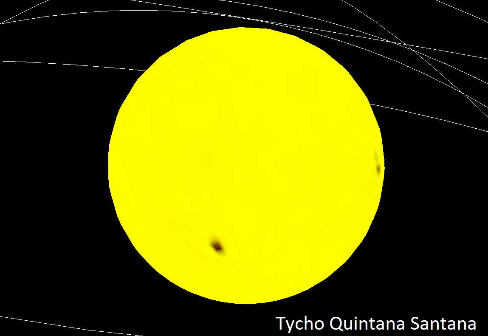
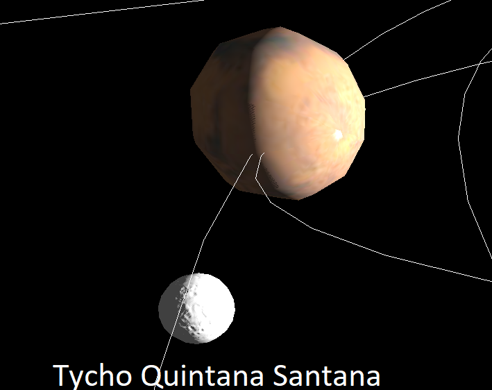
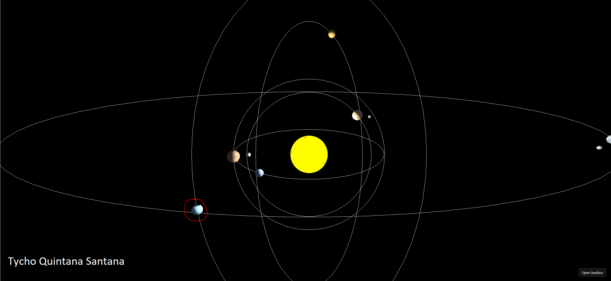
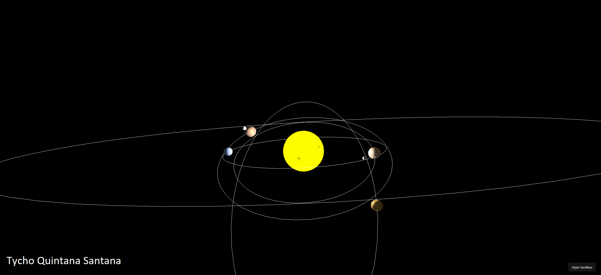
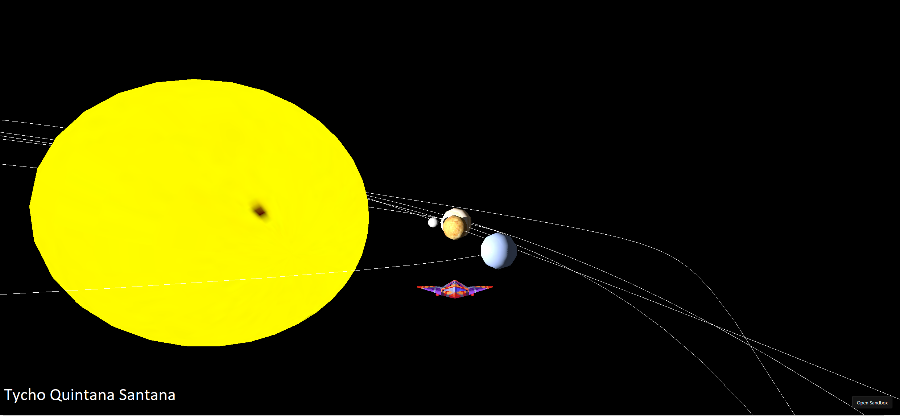

# Link to CodeSandBox
https://codesandbox.io/p/sandbox/entrega-p6-ig-tycho-quintana-santana-forked-dvjm7m

# Descripción de entrega
El trabajo consiste en la creación de un sistema planetario en 3D mediante el uso de la biblioteca _Three.js_ para trabajar conceptos propios de los gráficos por ordenador como lo son la iluminación, las sombras, las texturas, el control de cámara y modelos 3D. 

El proyecto se debe ejecutar mediante el enlace al proyecto en CodeSandbox del apartado anterior, no obstante  el código está disponible en el repositorio dentro de la carpeta ```src```. Sin embargo para ejecutarlo en local puede ser necesario realizar algún cambio ya que el formato con el que trabaja CodeSandBox no es compatible con todos los entornos de desarrollo. 

# Trabajo realizado
## Descripción del trabajo realizado
Se implementa unn sistema planteario con _Three.js_ que integra 5 planetas algunos de ellos con una luna, asi como un sol que actúa como fuente de luz junto a una luz ambiental. Esta provocan sombras en el sistema planetario. La posibilidad de dos vistas, vista general del sistema y vista piloto de una nave.
Como posible mejora seria interesante añadir algún tipo de detector de coliciones, ya que actualmente los objetos se atraviesan entre si. 

## Desarrollo principal
El código principal tiene dos funciones, ```init()```, que se encarga de inicializar todo lo necesario para la ejecución del programa, y ```animationLoop()``` que se encarga de manejar toda la lógica relacionada con la animación.   

En la función ```init()``` lo primero que hace es llamar a ```initTextures()``` para cargar las diferentes texturas que se van a usar para que estén totalmente disponibles para el resto de la ejecución sin problemas. Las texturas usadas se pueden encontrar dentro de la carpeta ```src```. Se cargan texturas para los 5 planetas, para el sol y dos para las lunas, una de ellas la textura básica y otra para el mapa de relieve.
```js
function initTextures() {
  texture1 = new THREE.TextureLoader().load("src/pluto.jpg");
  texture2 = new THREE.TextureLoader().load("src/jupiter.jpg");
  texture3 = new THREE.TextureLoader().load("src/neptune.jpg");
  texture4 = new THREE.TextureLoader().load("src/mars.jpg");
  texture5 = new THREE.TextureLoader().load("src/venus.jpg");
  sunTexture = new THREE.TextureLoader().load("src/sun.jpg");
  moonbump = new THREE.TextureLoader().load("src/moonbump.jpg");
  moonTexture = new THREE.TextureLoader().load("src/moonmap4k.jpg");
}
```

A continuación, ```initScene()``` se encarga de configurar la escena. Dentro de esta función se crean las cámaras (la cámara general y la cámara de la nave), se inicializa el renderizador de _Three.js_, se añaden los controles de cámara (OrbitControls y FlyControls) y se prepara un plano invisible que se usará para el _raycasting_. 
```js
function initScene() {
  scene = new THREE.Scene();

  shipCamera = new THREE.PerspectiveCamera(
          shipCameraSettings.fov,
          shipCameraSettings.aspect,
          shipCameraSettings.near,
          shipCameraSettings.far
  );

  shipCamera.position.set(
          shipCameraSettings.x,
          shipCameraSettings.y,
          shipCameraSettings.z
  );

  shipCamera.lookAt(0, 0, 0);
  scene.add(shipCamera);

  generalCamera = new THREE.PerspectiveCamera(
          cameraSettings.fov,
          cameraSettings.aspect,
          cameraSettings.near,
          cameraSettings.far
  );
  generalCamera.position.set(
          cameraSettings.x,
          cameraSettings.y,
          cameraSettings.z
  );

  renderer = new THREE.WebGLRenderer();
  renderer.setSize(renderSettings.width, renderSettings.height);
  renderer.shadowMap.enabled = true; // Activando sombras
  document.body.append(renderer.domElement);

  camControls = new OrbitControls(generalCamera, renderer.domElement);
  flyControls = new FlyControls(shipCamera, renderer.domElement);
  flyControls.dragToLook = true;
  flyControls.movementSpeed = 1;
  flyControls.rollSpeed = 0.5;
  flyControls.enabled = false;

  currentCamera = generalCamera;
  initLights();

  zplane = new THREE.Mesh(zplaneSettings.geometry, zplaneSettings.material);
  zplane.visible = false;
  scene.add(zplane);
}
```

Además dentro de ```initScene()```, se llama a ```initLights()``` para añadir las luces a la escena. En este caso como es un sistema solar, se ha optado por añadir solo dos tipos de luces. Luz ambiental para iluminar por igual a todos los objetos y una luz de tipo _PointLight_ que ilumina en todas las direcciones (como si fuese una bombilla) en el origen, para imitar el comportamiento del sol. En estos además se activa el sombreado en el renderizador y en la luz de tipo _Pointlight_, ya que queremos teniendo luces, queremos que se generen sombras.
```js
function initLights() {
  const ambientLight = new THREE.AmbientLight(0x404040);
  scene.add(ambientLight);
  const pointLight = new THREE.PointLight(0xffffff, 3, 100); // Luz del sol
  pointLight.position.set(0, 0, 0);
  pointLight.castShadow = true; // Activando que la luz del sol pueda generar sombras
  pointLight.shadow.mapSize.width = 4096; // Propiedades obtenidas de: https://threejs.org/docs/#api/en/lights/shadows/PointLightShadow como dice aqui, cuanto mayores son, mejores las sombras https://threejs.org/docs/index.html#api/en/lights/shadows/LightShadow
  pointLight.shadow.mapSize.height = 4096;
  scene.add(pointLight);
}
```

```initEventListeners()``` configura los eventos del usuario. Se añade un listener para detectar clics de ratón, que permite crear nuevos planetas con _raycasting_, y un listener para el teclado, que permite cambiar entre la vista general y la vista desde la nave. Las funciones asociadas a las pulsaciones, simplemente cambian cual es la cámara activa y desabilitan los controles asociados a la otra cámara.
```js
function initEventListeners() {
  document.addEventListener("mousedown", onDocumentMouseDown); // Gestión de evento de clic de ratón
  document.addEventListener("keydown", (e) => {
    // Gestión de evento para pulsaciones en teclado
    if (e.key === "G" || e.key === "g") generalView();
    if (e.key === "N" || e.key === "n") shipView();
  });
}
```

La función ```Estrella()``` se encarga de crear el sol de la escena. Para ello se genera una esfera a la que se le debe de pasar un radio, el color y opcionalmente una textura que se le puede aplicar.
```js
function Estrella(rad, col, texture = undefined) {
  let geometry = new THREE.SphereGeometry(rad, 32, 32);
  let material = new THREE.MeshBasicMaterial({ color: col, wireframe: false });
  if (texture) {
    material.map = texture;
  }
  sun = new THREE.Mesh(geometry, material);
  scene.add(sun);
}
```

A continuación una imagen del sol del proyecto:


Tras esto se llama a la función ```initPlanetas()``` que se encarga de inicializar 5 planetas y sus lunas asociadas si las tienen.
```js
function initPlanetas() {
  Planeta(4, 2, 0.4, 0.8, 0.008, nocolor, 9, 3, texture3);

  Planeta(0, 6, 0.5, 0.6, -0.003, nocolor, 2, 2, texture2);
  Luna(planets[1], 0.15, 1.2, 2, 0.01, nocolor, 0, moonTexture);

  Planeta(-5, 3, 0.35, 1.2, 0.003, nocolor, 2, 5, texture5);

  Planeta(7, -2, 0.6, 0.5, 0.001, nocolor, 3, 3, texture4);
  Luna(
    planets[3],
    0.2,
    1.5,
    1.5,
    0.05,
    nocolor,
    Math.PI / 4,
    undefined,
    moonbump
  );

  Planeta(-4, -6, 0.45, 0.1, 0.01, nocolor, 5, 1, texture1);
  Luna(
    planets[4],
    0.18,
    1.3,
    1.8,
    -0.02,
    nocolor,
    Math.PI / 6,
    moonTexture,
    moonbump
  );
}
```

Para ello usamos las funciones ```Planeta()``` que genera un planeta que orbita alrededor del sol en una trayectoria elíptica. Recibe como parámetros la posición inicial (x, y), el radio del planeta, la velocidad orbital, la velocidad de rotación, el color, los semiejes de la elipse (f1, f2) y opcionalmente una textura. La función calcula el ángulo inicial basándose en la posición para que el planeta comience exactamente donde se especifica, independientemente del tiempo que haya pasado, lo que será útil en la funcionalidad de añadir planetas dinámicamente que se mencionará posteriormente. Además se  representa visualmente la órbita elíptica mediante una línea blanca. El planeta se configura para proyectar y recibir sombras.
```js
function Planeta(
        x,
        y,
        radioPlaneta,
        vel,
        rotVel,
        col,
        f1,
        f2,
        texture = undefined
) {
  const scaleFactor = Math.sqrt(Math.pow(x / f1, 2) + Math.pow(y / f2, 2)); // Distancia para la elipse, que no tiene ambos ejes del mismo tamaño
  let geom = new THREE.SphereGeometry(radioPlaneta, 10, 10);
  let mat = new THREE.MeshPhongMaterial({ color: col });
  if (texture != undefined) {
    mat.map = texture;
  }
  let planeta = new THREE.Mesh(geom, mat);
  planeta.userData.angleOffset =
          Math.atan2(y / (scaleFactor * f2), x / (scaleFactor * f1)) -
          timestamp * vel; // timestampt varia constantemente aun cuando no hemos añadido ningún planeta, por eso debemos de hacer la resta. Además dividimos entre los radios de los semiejes, ya que es una trayectoria de elipse no de circunferencia
  planeta.userData.scaleFactor = scaleFactor;
  planeta.userData.speed = vel;
  planeta.userData.rotSpeed = rotVel;
  planeta.userData.f1 = f1;
  planeta.userData.f2 = f2;
  planeta.position.set(x, y, 0);
  planeta.castShadow = true;
  planeta.receiveShadow = true;
  planets.push(planeta);
  scene.add(planeta);

  let curve = new THREE.EllipseCurve(
          0,
          0, // centro
          scaleFactor * f1,
          scaleFactor * f2 // radios elipse
  );

  let points = curve.getPoints(50);
  let geome = new THREE.BufferGeometry().setFromPoints(points);
  let mate = new THREE.LineBasicMaterial({ color: 0xffffff });

  let orbita = new THREE.Line(geome, mate);
  scene.add(orbita);
}
```
y ```Luna()``` que  crea una luna que orbita alrededor de un planeta padre en una trayectoria circular. Para lograr órbitas inclinadas, se utiliza un objeto pivote que permite rotar el plano orbital mediante el parámetro angle. Recibe como parámetros el planeta padre, el radio de la luna, la distancia orbital, la velocidad orbital, la velocidad de rotación, el color, el ángulo de inclinación del plano orbital y opcionalmente una textura base y un mapa de relieve (bump map) para añadir detalles a la textura. La luna se configura para proyectar y recibir sombras.
```js
function Luna(padre, radio, dist, vel, rotVel, col, angle, texture = undefined, textbump = undefined) {
  var pivote = new THREE.Object3D();
  pivote.rotation.x = angle;
  padre.add(pivote);
  var geom = new THREE.SphereGeometry(radio, 10, 10);
  var mat = new THREE.MeshPhongMaterial({
    color: col,
  });
  if (texture != undefined) {
    mat.map = texture;
  }
  if (textbump != undefined) {
    mat.bumpMap = textbump;
    mat.bumpScale = 0.01;
  }
  var luna = new THREE.Mesh(geom, mat);
  luna.userData.dist = dist;
  luna.userData.speed = vel;
  luna.userData.rotSpeed = rotVel;
  const initialAngle = timestamp * vel;
  luna.position.set(Math.cos(160) * dist, Math.sin(160) * dist, 0);
  luna.receiveShadow = true;
  luna.castShadow = true;
  lunas.push(luna);
  pivote.add(luna);
}
```

A continuación una imagen de un planeta y su luna (en este caso es la luna que solo tiene textura normal):


Finalmente en este bloque de inicialización, se llama a la función ```initNave()``` que se encarga de cargar el modelo de la nave que se ve en la vista de nave, modificar el tamaño y su posición para que sea visible y asignarlo como hijo de la cámara.
```js
function initNave() {
  const loader = new GLTFLoader(); // https://threejs.org/docs/#examples/en/loaders/GLTFLoader
  loader.load(
    "src/pixel_space_ship.glb", // "Pixel Space Ship" (https://skfb.ly/o6qU6) by Bucky is licensed under Creative Commons Attribution (http://creativecommons.org/licenses/by/4.0/). No changes
    (gltf) => {
      shipModel = gltf.scene;
      shipModel.scale.set(0.002, 0.002, 0.002);
      shipCamera.add(shipModel); // https://stackoverflow.com/questions/17218054/how-to-put-an-object-in-front-of-camera-in-three-js
      shipModel.position.set(0, -0.5, -2);
    },
    undefined,
    (error) => console.error("Error cargando modelo:", error)
  );
}
```

Tras todas las inicializaciones pertinentes, se pasa a llamar al método ```animationLoop()``` que maneja toda la lógica de animación. En este usando el tiempo que ha pasado desde el comienzo de ejecución se cálcula el ángulo (teniendo en cuenta el posible offset de los planetas) y, se itera entre todos los cuerpos celestes para calcular su nueva posición mediante el uso de la ecuación parámetrica de una elipse centrada en el origen (para los planetas) y de la circunferencia (para las lunas). También se controla la actualización de _FlyControls_ y finalmente se renderiza la cámara actual. 
```js
function animationLoop() {
  timestamp = (Date.now() - t0) * accglobal;
  requestAnimationFrame(animationLoop);
  for (let object of planets) {
    const angle =
      timestamp * object.userData.speed + object.userData.angleOffset;
    object.position.x =
      Math.cos(angle) * object.userData.f1 * object.userData.scaleFactor;
    object.position.y =
      Math.sin(angle) * object.userData.f2 * object.userData.scaleFactor;
    object.rotation.z += object.userData.rotSpeed;
  }

  for (let object of lunas) {
    object.position.x =
      Math.cos(timestamp * object.userData.speed) * object.userData.dist;
    object.position.y =
      Math.sin(timestamp * object.userData.speed) * object.userData.dist;
    object.rotation.z += object.userData.rotSpeed;
  }

  if (currentCamera == shipCamera) {
    let fct1 = new Date();
    let secs = (fct1 - fct0) / 1000;
    flyControls.update(1 * secs);
    fct0 = fct1;
  }
  renderer.render(scene, currentCamera);
}
```
## Otros añadidos y funciones auxiliares
La función ```onDocumentMouseDown()``` gestiona los eventos de clic del ratón para añadir nuevos planetas de forma interactiva. Solo se activa con el botón central del ratón (rueda) y cuando se está en la vista general. Utiliza _raycasting_ para detectar la intersección del rayo disparado desde la posición del cursor con el plano invisible (zplane), convirtiendo las coordenadas del ratón en coordenadas dentro del plano invisible. Si hay intersección, crea un nuevo planeta en esa posición con propiedades aleatorias: color aleatorio mediante ```randomHexColor()```, velocidad orbital y de rotación aleatorias, y semiejes de elipse aleatorios para generar órbitas variadas. La función calcula el **factor de escala** (```scaleFactor```) que representa la distancia real desde el origen hasta el punto inicial (x, y) considerando que la órbita es elíptica y no circular. Esto es relevante para calcular el ```angleOffset``` que permite que el planeta comience exactamente en la posición especificada por el cursor independientemente del tiempo transcurrido, y segundo, para escalar correctamente los semiejes de la elipse multiplicándolos por este factor, asegurando que la órbita pase exactamente por el punto inicial dado.
```js
function onDocumentMouseDown(event) {
  event.preventDefault();
  if (event.which != 2 || currentCamera == shipCamera) return;
  const rect = renderer.domElement.getBoundingClientRect();
  click.x = ((event.clientX - rect.left) / rect.width) * 2 - 1;
  click.y = -((event.clientY - rect.top) / rect.height) * 2 + 1;

  raycaster.setFromCamera(click, generalCamera);

  const intersects = raycaster.intersectObject(zplane);
  if (intersects.length > 0) {
    // Intersection Coordinates
    const intersectionPoints = intersects[0].point;

    // Distance from sun to clicked point
    const f1 = Math.random() * 1.5 + 0.5;
    const f2 = Math.random() * 1.5 + 0.5;
    Planeta(
            intersectionPoints.x,
            intersectionPoints.y,
            0.5,
            Math.random() * 3,
            Math.random(),
            randomHexColor(),
            f1,
            f2
    );
  }
}
```
A continuación una imagen de una planeta generado de esta manera. 



La función ```randomHexColor()``` genera un color hexadecimal aleatorio para los planetas creados dinámicamente por el usuario.
```js
function randomHexColor() {
  return "#" + Math.floor(Math.random() * 16777215).toString(16);
}
```

Las funciones ```generalView()``` y ```shipView()``` permiten alternar entre las dos cámaras disponibles en la aplicación. ```generalView()``` activa la cámara general, con los controles ```OrbitControls```, permitiendo observar todo el sistema planetario desde una perspectiva externa con capacidad de rotación, traslación y zoom. Por otro lado, ```shipView()``` activa la cámara de la nave con los controles ```FlyControls```, permitiendo navegar libremente por el espacio. Ideal para apreciar mejor los detalles de las sombras y la iluminación en los diferentes cuerpos celestes. Además, reinicia el contador de tiempo (```fct0```) para calcular correctamente el delta time en la actualización de los controles de vuelo.
```js
function generalView() {
  currentCamera = generalCamera;
  camControls.enabled = true;
  flyControls.enabled = false;
}

function shipView() {
  currentCamera = shipCamera;
  camControls.enabled = false;
  flyControls.enabled = true;
  fct0 = new Date();
}
```

En el ```html``` se ha añadido una pequeña sección sobre la escena que indica los controles, asi como un título para mostrar.
```html
<h2>Práctica S6 Tycho Quintana Santanta: Sistema Planteario en Three.js</h2>
<div style="font-size: 12px">
  Vista General (Presionar G): Arrastrar izq. = rotar, Arrastrar der. =
  desplazar, Rueda = zoom<br />
  Vista de Nave (Presionar N): WASD = mover, Q/E = rodar, Arrastrar ratón =
  mirar
</div>
```

# Controles
- G: Activar "Vista general"
  - Vista general:
    - Clic izquierdo y mover ratón: Rotar escena
    - Clic derecho y mover ratón: Trasladar escena
    - Rueda ratón: Zoom escena
    - Clic rueda ratón: Añadir un planeta con color aleatorio y órbita elíptica donde está el cursor si está sobre el plano Z
- N: Activar "Vista de nave"  
  - Vista de nave:
    - Clic izquierdo y derecho mientras se mueve el ratón: Mover la cámara
    - W: Desplazarse hacia delante
    - S: Desplazarse hacia detrás
    - A: Desplazarse a la izquierda
    - D: Desplazarse a la derecha
    - Q/E: Rotar
   
# Vídeo de demostración y capturas
## Vista general


## Vista de nave


## Vídeo
[Ver vídeo de ejecución del sistema planetario](./DEMO.mp4)

# Referencias
- https://github.com/otsedom/otsedom.github.io/tree/main/IG/S6
- https://github.com/otsedom/otsedom.github.io/tree/main/IG/S7
- https://developer.mozilla.org/en-US/docs/Web/API/Element/getBoundingClientRect
- https://threejs.org/docs/#api/en/core/Raycaster
- https://threejs.org/docs/#examples/en/loaders/GLTFLoader
- "Pixel Space Ship" (https://skfb.ly/o6qU6) by Bucky is licensed under Creative Commons Attribution (http://creativecommons.org/licenses/by/4.0/). No changes
- https://stackoverflow.com/questions/17218054/how-to-put-an-object-in-front-of-camera-in-three-js
- https://threejs.org/docs/#api/en/lights/shadows/PointLightShadow
- https://threejs.org/docs/index.html#api/en/lights/shadows/LightShadow

# Uso de IA
- Facilitación en la elaboración del README (fallos ortográficos, revisar si faltaba algo por mencionar, propuestas basadas en plantillas previas hechas por mi para elaborar explicaciones de otros métodos en el README del código).
- Ayuda para buscar como cargar un modelo 3D en _Three.js_ y asignarlo como hijo de la cámara.
- Ayuda en la búsqueda de documentación de _Three.js_, tanto oficial como foros.
- Ayuda para el tratamiento geómetrico de la elipse a la hora de crear planetas dinámicamente.
