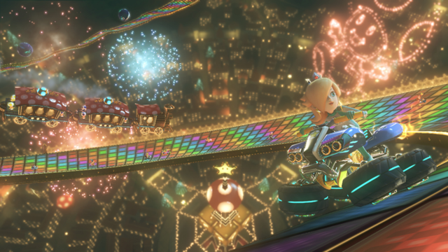
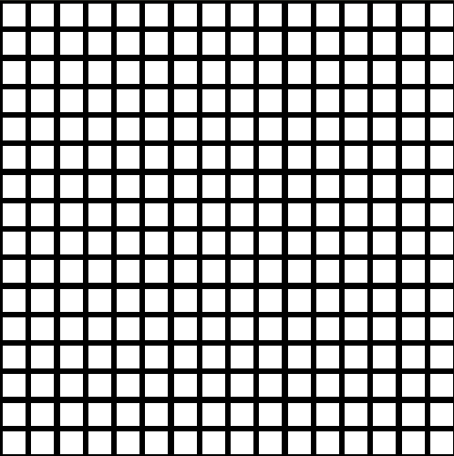
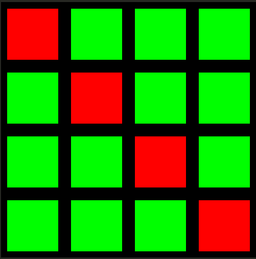
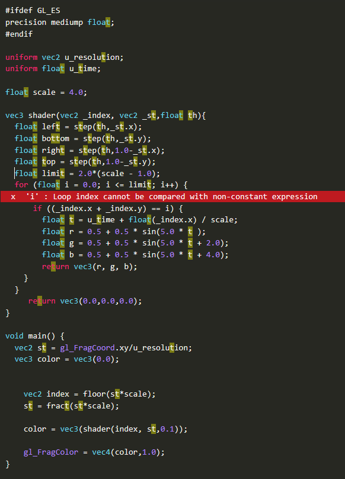
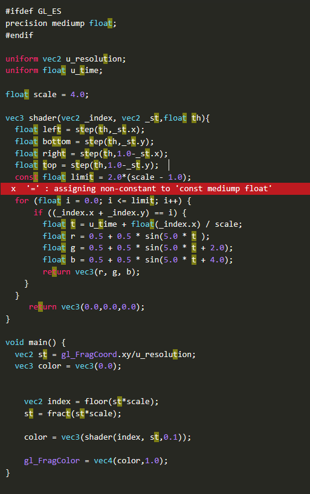

# Desarrollo de un _Shader_

## Enlace al proyecto
En este caso como se ha desarrollado un _shader_ con patrones generativos, no se ha usado codesandbox, sino que se ha desarrollado
en este [editor web](https://editor.thebookofshaders.com/). Es por eso que en vez de un enlace a un proyecto, se lo dejamos al fichero con el código fuente.

## Descripción de entrega

La entrega consiste en el desarrollo de un _shader_ con patrones generativos que sea ejecutable en el [editor de The Book of Shaders](https://editor.thebookofshaders.com/).
Además deberemos de entregar una versión "_tiny code_" que tenga un tamaño inferior a 512 _bytes_.  

Asímismo, se debe de presentar una documentación exhaustiva acerca del desarrolo del _shader_, asi como de la motivación del mismo. Es por ello que en este _readme_
se iran describiendo los pasos e intenciones detrás de los diferentes resultados parciales que se obtuvieron hasta llegar al _shader_ final que se presenta en esta entrega.

## Motivación del _shader_ propuesto

Mientras iba leyendo el readme para familiarizarme con las cosas que se podían hacer a través de los diferentes ejemplos, vi [el siguiente ejemplo,
que extraigo del propio repositorio de la práctica:](https://github.com/otsedom/otsedom.github.io/blob/main/IG/S9/images/p9_editorDibuja25.png)


Me recordó al recurrente mapa del videojuego Mario Kart llamado "Senda Arcoiris" debido a que la carrera tiene lugar sobre un arcoiris.
A continuación una imagen del mapa que menciono. La imagen ha sido extraída de _Google Imágenes_. 

Nótese cómo de fondo se ve un "suelo" que está formado por una cuadrícula multicolor como
si de un arcoíris se tratáse.

Como además, quería hacer algo que diera lugar o pareciera  una ilusión óptica como las que vimos durante las primeras semanas, decidí finalmente
realizar un _shader_ que tuviese una cuadrícula en la que se fuesen dibujando en función del tiempo colores intentando formar un patrón de arcoíris.

Con eso en mente comencé a desarrollar el _shader_.

## Trabajo realizado

### Punto de partida
Dado que el objetivo era conseguir un patrón que se repitiese a lo largo de la superficie del render final, se tomó como
base uno de los _shaders_ de ejemplo de la práctica. En concreto, se utilizó el siguiente código para crear una cuadrícula 
de círculos:
```GLSL
#ifdef GL_ES
precision mediump float;
#endif

uniform vec2 u_resolution;

float scale = 3.0;

float circle(in vec2 _st, in float _radius){
    vec2 l = _st-vec2(0.5);
    return 1.-smoothstep(_radius-(_radius*0.01),
                         _radius+(_radius*0.01),
                         dot(l,l)*4.0);
}
void main() {
  vec2 st = gl_FragCoord.xy/u_resolution;
  vec3 color = vec3(0.0);

    //Escala en función de la escala adoptada
    st = fract(st*scale);

    // Dibuja un círculo en cada "celda"
    color = vec3(circle(st,0.5));

	gl_FragColor = vec4(color,1.0);
}
```

Este código simplemente entre 0 y 1 la posición de cada pixel y la escala a la escala definida por la variable ```scale```
quedando entonces los valores entre 0 y 3. Posteriormente con la función ```fract()``` [fuerza a que las coordenadas se vuelvan a 0.0 de 0.0 a 1.0 cada vez que se supera la unidad.](https://docs.gl/el3/fract),
Esto genera automáticamente tres regiones (celdas) horizontales y tres verticales, creando una cuadrícula repetitiva de nueve celdas en total.

Finalmente la función
```circle()``` [se encarga de decidir el color del píxel en función de si la posición que se le pasa está dentro del circulo](https://docs.gl/el3/smoothstep)
la distancia al centro con [```dot()```](https://docs.gl/el3/dot).


El resultado que produce es el de la siguiente [figura](https://github.com/otsedom/otsedom.github.io/tree/main/IG/S9):


### Cambio de círculos a cuadrados
Como lo que realmente queremos mostrar son cuadrados, no círculos, modificamos la función que elige el color del píxel 
para generar una forma cuadrada. Además, aumentamos la escala para formar más regiones en el lienzo. El método cuadro ha sido tomado
del [repositorio](https://github.com/otsedom/otsedom.github.io/tree/c5449dc9df35caa5b408b0365f90471240ab48ae/IG/S9) con el guión de la práctica.
```glsl
#ifdef GL_ES
precision mediump float;
#endif

uniform vec2 u_resolution;

float scale = 16.0;

float cuadro(vec2 _st,float th){
  float left = step(th,_st.x);
  float bottom = step(th,_st.y);
  float right = step(th,1.0-_st.x);
  float top = step(th,1.0-_st.y);

  return left*bottom*right*top;
}

void main() {
  vec2 st = gl_FragCoord.xy/u_resolution;
  vec3 color = vec3(0.0);
  st = fract(st*scale);
  color = vec3(cuadro(st,0.1));
  gl_FragColor = vec4(color,1.0);
}
```

Lo que se ha hecho es definir una función ```cuadro()``` que ahora da lugar a formas que son cuadrados. Para ello
lo que se hace es dentro de la región, usar la función ```step()``` [que permite realizar operaciones de umbralización](https://docs.gl/el3/step). De esta forma y teniendo
en cuenta los cuatro lados se generan valores entre 0 y 1 para cada uno de ellos. Al multiplicar los cuatro valores 
(`left * bottom * right * top`), obtenemos `1.0` (blanco) solo en la región donde todas las condiciones se cumplen 
(el píxel está dentro del cuadrado), y `0.0` (negro) en cualquier otro caso.

Eso genera el siguiente resultado:



Es importante resaltar que el segundo parámetro que le llega a la función ```cuadros()``` determina la "anchura" del borde
entre cada región. 

### Disminución de la complejidad del problema

Para facilitar el desarrollo del _shader_, reducimos la escala a una versión 4x4 que facilitará resolver el problema. Una vez resuelto el problema
para generar los colores de la manera deseada, podremos volver a cambiar la escala para generar más regiones. Además, comenzamos
a jugar con los colores para seleccionar elementos concretos del _shader_. En este caso hemos hecho que se pinte de rojo
lo que se podría denominar como "diagonal principal", mientras que el resto de cuadrados sean verdes y el fondo negro. Asimismo,
se ha renombrado la función, que ahora se llama `shader()`, ya que lo que hace es generar el color del píxel sobre el que se va
a ejecutar, devolviendo ahora directamente el vector en vez de un único valor.
```glsl
#ifdef GL_ES
precision mediump float;
#endif

uniform vec2 u_resolution;

float scale = 4.0;

vec3 shader(vec2 _index, vec2 _st, float th){
  float left = step(th, _st.x);
  float bottom = step(th, _st.y);
  float right = step(th, 1.0-_st.x);
  float top = step(th, 1.0-_st.y);
    
  if ((left*bottom*right*top) != 1.0) return vec3(0.0);
    
  if ((_index.x + _index.y) == scale-1.0) return vec3(1.0, 0.0, 0.0);
  else return vec3(0.0, 1.0, 0.0);
}

void main() {
  vec2 st = gl_FragCoord.xy/u_resolution;
  vec3 color = vec3(0.0);

  vec2 index = floor(st*scale);
  st = fract(st*scale);

  color = vec3(shader(index, st, 0.1));

  gl_FragColor = vec4(color,1.0);
}
```

Para el coloreado se sigue cumpliendo que los elementos que no estén dentro de un cuadrado sean negros. Para ello, si el píxel
no cumple la condición de estar dentro del cuadrado (que recordamos que se conoce gracias al producto de los 4 umbrales calculados),
devolvemos negro. En caso contrario, revisamos si la suma de las posiciones `x` e `y` es igual a la escala menos uno (ya que las posiciones
comienzan en cero): si es así, el píxel pertenece a la "diagonal principal" y devolvemos el color rojo. En caso contrario, verde.

El resultado que da ese _shader_ es el siguiente:



### Efecto arcoíris en diagonal principal

Queremos conseguir un efecto de arcoíris en las diagonales que dé la ilusión de que los colores se desplazan. Para ello,
comenzamos disminuyendo el problema a un elemento del _shader_ con el cual ya sabemos interactuar, la "diagonal principal".

```glsl
#ifdef GL_ES
precision mediump float;
#endif

uniform vec2 u_resolution;
uniform float u_time;

float scale = 4.0;

vec3 shader(vec2 _index, vec2 _st,float th){
  float left = step(th,_st.x);
  float bottom = step(th,_st.y);
  float right = step(th,1.0-_st.x);
  float top = step(th,1.0-_st.y);  
  if ((_index.x + _index.y) == (scale-1.0)) {
      float t = u_time + float(_index.x) / scale; 
      float r = 0.5 + 0.5 * sin(5.0 * t );
      float g = 0.5 + 0.5 * sin(5.0 * t + 2.0);
      float b = 0.5 + 0.5 * sin(5.0 * t + 4.0);
      return vec3(r, g, b);   
  }
  return vec3(0.0,0.0,0.0);
}

void main() {
  vec2 st = gl_FragCoord.xy/u_resolution;
  vec3 color = vec3(0.0);
  vec2 index = floor(st*scale);
  st = fract(st*scale);
  color = vec3(shader(index, st,0.1));
  gl_FragColor = vec4(color,1.0);
}
```

En este caso lo que hemos hecho es que todos los píxeles que no formen parte de la diagonal principal, serán negros.
Para los de la "diagonal principal" se ha declarado la variable ```u_time```, que lleva cuenta del tiempo ha pasado desde que ha comenzado el programa. 

Para que cada región tenga un color propio y animado, se ha hecho declararado una variable ```t``` que cambia en función del tiempo y de la posición
del píxel. De esta manera, como el condicional que genera los colores agrupa por cuadrados de regiones, cada región tendrá
su propio color, que irá rotando hacia la región de arriba a la izquierda dando la impresión de que se mueven por la "diagonal
principal".

Además como la función seno da valores entre -1 y 1 se le suma dos veces 0.5 para desplazarla al rango 0 - 1 que es con el
que trabaja _GLSL_ para los colores. Es decir se ha normalizado el valor del color resultado.

Finalmente, se añade un desfase a los canales Verde y Azul. Esto evita que los tres canales sean muy similares 
(lo que resultaría en escala de grises), asegurando que el _shader_ pase por todos diferentes tonos de colores del espectro.

El resultado que queda es:


### Intentando aplicar el efecto a todas las regiones

Ahora intentamos que el efecto de color se aplique a todas las celdas de la cuadrícula, no solo a una. Como queremos que todos las regiones que 
estén en la misma "antidiagonal" tengan el mismo color, nos fijamos en que si tratamos esto como si fuese una matriz, todas
aquellas celdas cuya suma de coordenas _i_ y _j_ sea constante forman parte de la misma "antidiagonal".
$$
\begin{pmatrix}
a_{1,1} & a_{1,2} & a_{1,3} & a_{1,4} \\
a_{2,1} & a_{2,2} & a_{2,3} & a_{2,4} \\
a_{3,1} & a_{3,2} & a_{3,3} & a_{3,4} \\
a_{4,1} & a_{4,2} & a_{4,3} & a_{4,4}
\end{pmatrix}
$$

Como se puede ver en la matriz de ejemplo, para las siguiente posiciones que están en la misma "antidiagonal":

$$a_{3,1}, a_{2,2}, a_{1,3}$$

La suma de sus índices resulta en un valor constante _k_ (en este caso _k_ = 4).

Es por ello que ahora lo que se hace es agrupar en el condicional
por esa condición, de manera que todos los píxeles que cumplan que la suma de su coordenada _x e_ _y_ es constante, se colorearán
de la misma manera. Para ello además añadimos un bucle for que itere por los distintos valores de _k_. En nuestro caso
se permite que una coordenada tenga valor 0. Además sabemos que el límite vendrá dado por el valor de la escala menos 1.


Sin embargo como muestran las siguientes capturas, para poder realizar una comparación con scale, esta debe de ser constante.




El código quedó finalmente asi:
```glsl
#ifdef GL_ES
precision mediump float;
#endif

uniform vec2 u_resolution;
uniform float u_time;
const float scale = 4.0;

vec3 shader(vec2 _index, vec2 _st,float th){
  float left = step(th,_st.x);
  float bottom = step(th,_st.y);
  float right = step(th,1.0-_st.x);
  float top = step(th,1.0-_st.y);  
  const float limit = 2.0*(scale - 1.0);
  for (float i = 0.0; i <= limit; i++) {
      if ((_index.x + _index.y) == i) {
        float t = u_time + float(_index.x) / scale; 
        float r = 0.5 + 0.5 * sin(5.0 * t );
        float g = 0.5 + 0.5 * sin(5.0 * t + 2.0);
        float b = 0.5 + 0.5 * sin(5.0 * t + 4.0);
        return vec3(r, g, b);   
    }
  }
     return vec3(0.0,0.0,0.0);
}

void main() {
  vec2 st = gl_FragCoord.xy/u_resolution;
  vec3 color = vec3(0.0);
  vec2 index = floor(st*scale);
  st = fract(st*scale);
  color = vec3(shader(index, st,0.1));
  gl_FragColor = vec4(color,1.0);
}
```

Y el _shader_ resultante es:

    

Nótese como ya no usamos los valores de umbral para nada desde la versión anterior, por lo que los bordes ya no se generan y
parecen franjas.

Sin embargo no es el resultado deseado. Ya que el color se esta propagando horizontalmente.

Por ello cambiamos el valor de ```t``` cambiando la coordenada
que tiene en cuenta para calcular su valor por el eje y, y ahora vemos que los colores parecen moverse verticalemente
en vez de horizontalmente. 

Codigo:
```glsl
#ifdef GL_ES
precision mediump float;
#endif

uniform vec2 u_resolution;
uniform float u_time;
const float scale = 4.0;

vec3 shader(vec2 _index, vec2 _st,float th){
  float left = step(th,_st.x);
  float bottom = step(th,_st.y);
  float right = step(th,1.0-_st.x);
  float top = step(th,1.0-_st.y);  
  const float limit = 2.0*(scale - 1.0);
  for (float i = 0.0; i <= limit; i++) {
      if ((_index.x + _index.y) == i) {
        float t = u_time + float(_index.y) / scale; 
        float r = 0.5 + 0.5 * sin(5.0 * t );
        float g = 0.5 + 0.5 * sin(5.0 * t + 2.0);
        float b = 0.5 + 0.5 * sin(5.0 * t + 4.0);
        return vec3(r, g, b);   
    }
  }
     return vec3(0.0,0.0,0.0);
}

void main() {
  vec2 st = gl_FragCoord.xy/u_resolution;
  vec3 color = vec3(0.0);
  vec2 index = floor(st*scale);
  st = fract(st*scale);
  color = vec3(shader(index, st,0.1));
  gl_FragColor = vec4(color,1.0);
}
```

Resultado:


Ahora vemos que se propaga verticalmente.

Tras esto nos damos cuenta de que lo que pasaba antes es que el desfase espacial solo estaba afectando a la posición 
horizontal, lo que hacía que el color se propagase por esa dirección.

### Propagación del color en diagonal y aumento de la escala
Tras lo mencionado en el apartado anterior nos damos cuenta de que el valor de ```t``` se debe calcular teniendo
en cuenta ambas coordenadas _x_ e _y_ si queremos que se propague vertical y horizontalmente de manera simultánea para
que de la impresión de que se propaga en diagonal. Además como ya hemos conseguido el efecto que queríamos restauramos la
escala de 16x16.

```glsl
#ifdef GL_ES
precision mediump float;
#endif

uniform vec2 u_resolution;
uniform float u_time;
const float scale = 16.0;
vec3 shader(vec2 _index, vec2 _st,float th){
  float left = step(th,_st.x);
  float bottom = step(th,_st.y);
  float right = step(th,1.0-_st.x);
  float top = step(th,1.0-_st.y);  
  const float limit = 2.0*(scale - 1.0);
  for (float i = 0.0; i <= limit; i++) {
      if ((_index.x + _index.y) == i) {
        float t = u_time + float(_index.x - _index.y) / scale; 
        float r = 0.5 + 0.5 * sin(5.0 * t);
        float g = 0.5 + 0.5 * sin(5.0 * t + 2.0);
        float b = 0.5 + 0.5 * sin(5.0 * t + 4.0);
        return vec3(r, g, b);   
    }
  }
     return vec3(0.0,0.0,0.0);
}

void main() {
  vec2 st = gl_FragCoord.xy/u_resolution;
  vec3 color = vec3(0.0);
  vec2 index = floor(st*scale);
  st = fract(st*scale);
  color = vec3(shader(index, st,0.1));
  gl_FragColor = vec4(color,1.0);
}
```
### _Shader_ de entrega
El _shader_ resultante queda de la siguiente manera


Con esto ya se ha conseguido el resultado deseado. Tenemos un _shader_ que genera la ilusión de colores desplazándose
diagonalmente con patrón de arcoíris. Este es el _shader_ que se entrega en la práctica. 

Todos los _shaders_ que se han ido mostrando e el desarrollo son ejecutables en el [editor de The Book of Shaders](https://editor.thebookofshaders.com/)
Los siguientes de los extras también lo son.

## Extras
Tras conseguir el _shader_ deseado se decidió manipulando el valor de los bordes y de la escala. Vemos entonces
que si usamos el valor generado por los umbrales y los multiplicamos todos por el vector color resultado se aplicarán
los bordes correspondientes.

El código se puede ver a continuación:
```glsl
#ifdef GL_ES
precision mediump float;
#endif

uniform vec2 u_resolution;
uniform float u_time;

const float scale = 16.0;

vec3 shader(vec2 _index, vec2 _st,float th){
  float left = step(th,_st.x);
  float bottom = step(th,_st.y);
  float right = step(th,1.0-_st.x);
  float top = step(th,1.0-_st.y);  
  float mask = left * bottom * right * top;
  const float limit = 2.0*(scale - 1.0);
  for (float i = 0.0; i <= limit; i++) {
      if ((_index.x + _index.y) == i) {
        float t = u_time + float(_index.x - _index.y) / scale; 
        float r = 0.5 + 0.5 * sin(5.0 * t);
        float g = 0.5 + 0.5 * sin(5.0 * t + 2.0);
        float b = 0.5 + 0.5 * sin(5.0 * t + 4.0);
        return vec3(r, g, b)*mask;   
    }
  }
     return vec3(0.0,0.0,0.0);
}

void main() {
  vec2 st = gl_FragCoord.xy/u_resolution;
  vec3 color = vec3(0.0);
  vec2 index = floor(st*scale);
  st = fract(st*scale);
  color = vec3(shader(index, st,0.1));
  gl_FragColor = vec4(color,1.0);
}
```

El resultado fue este, el cual es interesante porque al añadir bordes el movimiento de
los colores a través del _shader_ se ve diferente al del _shader_ de la entrega.


Mientras que en el de la entrega parece que el color se mueve por todo el espacio del _shader_ en esta última versión
da la impresión de que va saltando entre celdas debido a los bordes que son constantes.

Por otro lado variando el tamaño de la escala podemos hacer que las regiones se muestren más o menos.
Con una escala de 64x64 las regiones siguen siendo apreciables, pero son muy pequeñas.

Código del _shader_:
```glsl
#ifdef GL_ES
precision mediump float;
#endif

uniform vec2 u_resolution;
uniform float u_time;
const float scale = 64.0;
vec3 shader(vec2 _index, vec2 _st,float th){
  float left = step(th,_st.x);
  float bottom = step(th,_st.y);
  float right = step(th,1.0-_st.x);
  float top = step(th,1.0-_st.y);  
  const float limit = 2.0*(scale - 1.0);
  for (float i = 0.0; i <= limit; i++) {
      if ((_index.x + _index.y) == i) {
        float t = u_time + float(_index.x - _index.y) / scale; 
        float r = 0.5 + 0.5 * sin(5.0 * t);
        float g = 0.5 + 0.5 * sin(5.0 * t + 2.0);
        float b = 0.5 + 0.5 * sin(5.0 * t + 4.0);
        return vec3(r, g, b);   
    }
  }
     return vec3(0.0,0.0,0.0);
}

void main() {
  vec2 st = gl_FragCoord.xy/u_resolution;
  vec3 color = vec3(0.0);
  vec2 index = floor(st*scale);
  st = fract(st*scale);
  color = vec3(shader(index, st,0.1));
  gl_FragColor = vec4(color,1.0);
}
```

A continuación como se ve el _shader_:


Ya con 128,  yo no soy capaz de apreciar las regiones.

Código del _shader_:
```glsl
#ifdef GL_ES
precision mediump float;
#endif

uniform vec2 u_resolution;
uniform float u_time;
const float scale = 128.0;
vec3 shader(vec2 _index, vec2 _st,float th){
  float left = step(th,_st.x);
  float bottom = step(th,_st.y);
  float right = step(th,1.0-_st.x);
  float top = step(th,1.0-_st.y);  
  const float limit = 2.0*(scale - 1.0);
  for (float i = 0.0; i <= limit; i++) {
      if ((_index.x + _index.y) == i) {
        float t = u_time + float(_index.x - _index.y) / scale; 
        float r = 0.5 + 0.5 * sin(5.0 * t);
        float g = 0.5 + 0.5 * sin(5.0 * t + 2.0);
        float b = 0.5 + 0.5 * sin(5.0 * t + 4.0);
        return vec3(r, g, b);   
    }
  }
     return vec3(0.0,0.0,0.0);
}

void main() {
  vec2 st = gl_FragCoord.xy/u_resolution;
  vec3 color = vec3(0.0);
  vec2 index = floor(st*scale);
  st = fract(st*scale);
  color = vec3(shader(index, st,0.1));
  gl_FragColor = vec4(color,1.0);
}
```

A continuación como se ve el _shader_:


## Código fuente del _shader_ final
* **Versión Completa:** [shader.frag](code/shader.frag)
* **Versión _Tiny Code_:** [shader-tiny.frag](code/shader-tiny.frag)

La versión _tiny_ cumple los criterios de tamaño.

## Referencias
- https://github.com/otsedom/otsedom.github.io/tree/main/IG/S9
- https://docs.gl/ 

## Uso de IA
- Elaboración de código Latex
- Consultas puntuales para el readme
- Generación del _Tiny code_

